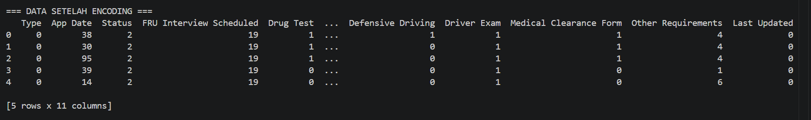
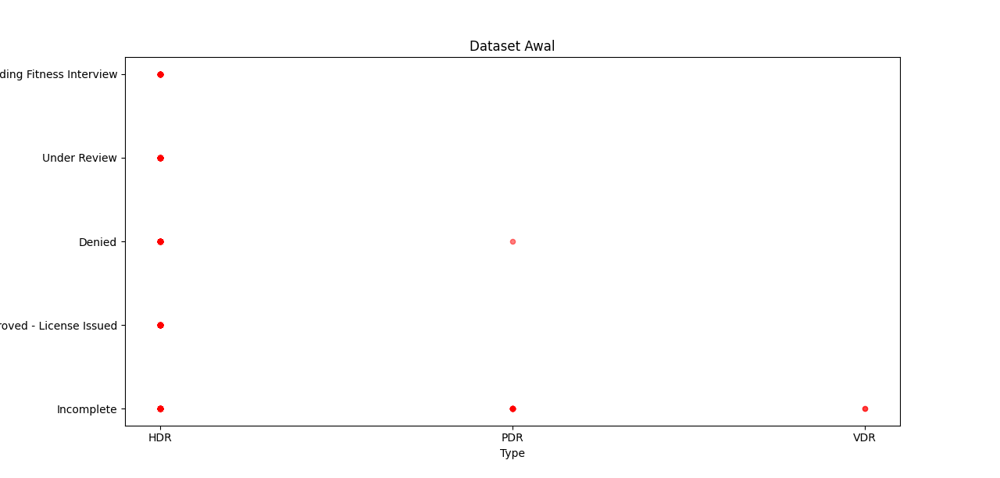
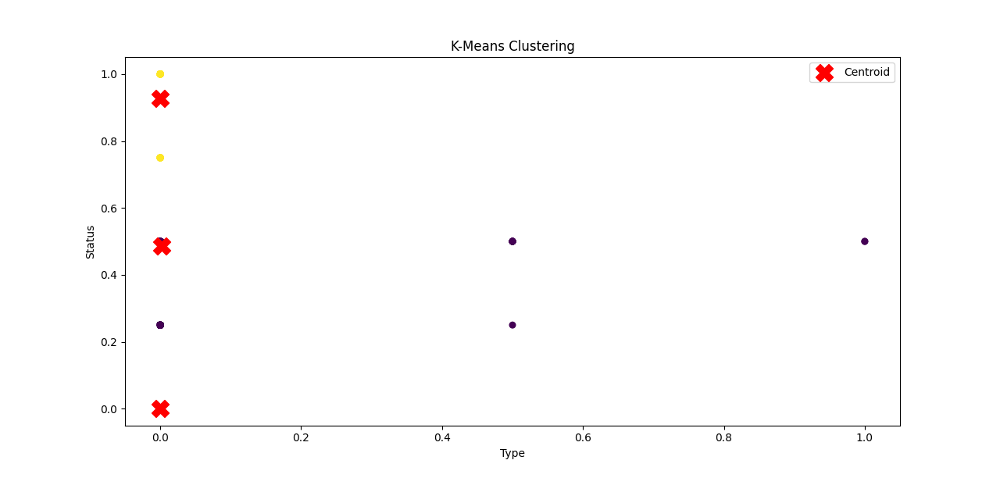
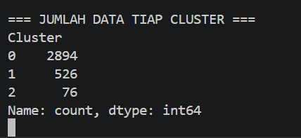

K-Means Clustering pada Dataset GPS Trajectories
Deskripsi

Proyek ini merupakan implementasi algoritma K-Means Clustering menggunakan dataset GPS Trajectories dari UCI Machine Learning Repository. Tujuan dari proyek ini adalah mengelompokkan data perjalanan berdasarkan karakteristik yang dimiliki sehingga data dengan karakteristik yang mirip berada pada cluster yang sama.

Dataset

Dataset yang digunakan:

Nama Dataset : GPS Trajectories
Sumber : https://archive.ics.uci.edu/dataset/354/gps+trajectories

File yang digunakan:

go_track_tracks.csv

Library yang Digunakan
import pandas as pd
import numpy as np
import matplotlib.pyplot as plt
import seaborn as sns

from sklearn.cluster import KMeans
from sklearn.preprocessing import MinMaxScaler

Tahapan Pengerjaan
1. Import Library

Mengimpor library yang diperlukan untuk membaca data, melakukan preprocessing, visualisasi, dan clustering.

2. Membaca Dataset

Dataset dibaca menggunakan Pandas dan dikonversi ke dalam bentuk DataFrame.

3. Melihat Informasi Dataset

Melihat struktur data, jumlah atribut, tipe data, dan jumlah data yang tersedia.

4. Data Cleaning

Kolom linha dihapus karena tidak digunakan dalam proses clustering.

5. Pemilihan Fitur

Fitur yang digunakan untuk proses clustering adalah:

Distance
Speed
6. Konversi Data ke Array

Data yang telah dipilih dikonversi menjadi array NumPy agar dapat diproses oleh algoritma K-Means.

7. Normalisasi Data

Normalisasi dilakukan menggunakan Min-Max Scaling untuk menyamakan rentang nilai setiap fitur.

8. Pembuatan Model K-Means

Model K-Means dibuat dengan jumlah cluster sebanyak 3.

9. Pelatihan Model

Model dilatih menggunakan data yang telah dinormalisasi.

10. Hasil Clustering

Label cluster ditambahkan ke dataset sehingga setiap data memiliki informasi cluster masing-masing.

Dokumentasi
Figure 1 - Dataset Awal

Menampilkan sebagian isi dataset yang digunakan pada proses clustering.

Figure 2 - Informasi Dataset

Menampilkan informasi dataset seperti jumlah data, jumlah atribut, dan tipe data setiap kolom.

Figure 3 - DataFrame Setelah Preprocessing

Menampilkan dataset setelah dilakukan pembersihan data dan pemilihan atribut yang digunakan untuk clustering.

Figure 4 - Hasil Konversi ke Array

Menampilkan hasil konversi data dari DataFrame menjadi array NumPy yang akan digunakan pada proses normalisasi dan clustering.

Figure 5 - Hasil Evaluasi

Menampilkan hasil evaluasi yang diperoleh selama proses praktikum sesuai langkah pada modul yang digunakan.

Hasil

Berdasarkan implementasi algoritma K-Means Clustering, data berhasil dikelompokkan ke dalam beberapa cluster berdasarkan kemiripan karakteristik perjalanan. Hasil clustering dapat digunakan untuk membantu analisis pola perjalanan pengguna berdasarkan atribut yang tersedia pada dataset.

Kesimpulan

Algoritma K-Means Clustering berhasil diterapkan pada dataset GPS Trajectories. Proses clustering dilakukan melalui tahapan preprocessing, normalisasi data, pelatihan model, dan analisis hasil cluster. Hasil yang diperoleh menunjukkan bahwa data dapat dikelompokkan berdasarkan karakteristik yang serupa sehingga memudahkan proses analisis data perjalanan.

# K-Means Clustering pada Dataset TLC New Driver Application Status

## Deskripsi Dataset

Dataset yang digunakan adalah **TLC New Driver Application Status** yang berisi informasi status pengajuan calon pengemudi. Dataset terdiri dari beberapa atribut seperti:

* Type
* App Date
* Status
* FRU Interview Scheduled
* Drug Test
* WAV Course
* Defensive Driving
* Driver Exam
* Medical Clearance Form
* Other Requirements
* Last Updated

Karena sebagian besar atribut bertipe kategorikal, dilakukan proses encoding agar data dapat diproses menggunakan algoritma K-Means.

---

## Tahap 1: Data Encoding

Pada tahap ini seluruh atribut kategorikal diubah menjadi bentuk numerik menggunakan metode **Label Encoding**. Tujuannya adalah agar setiap kategori dapat direpresentasikan dalam bentuk angka sehingga dapat diproses oleh algoritma clustering.

**Dokumentasi:**

Hasil encoding menunjukkan bahwa seluruh atribut kategorikal berhasil dikonversi menjadi data numerik.

---

## Tahap 2: Visualisasi Dataset Awal

Sebelum proses clustering dilakukan, data divisualisasikan terlebih dahulu menggunakan scatter plot untuk melihat persebaran data awal.

**Dokumentasi:**

Pada visualisasi tersebut seluruh data masih berada dalam satu kelompok dan belum memiliki label cluster.

---

## Tahap 3: Penentuan Jumlah Cluster dengan Metode Elbow

Metode Elbow digunakan untuk menentukan jumlah cluster yang optimal dengan melihat nilai WCSS (Within Cluster Sum of Squares).

**Dokumentasi:**

Dari grafik Elbow dapat ditentukan jumlah cluster yang digunakan dalam proses K-Means Clustering.

---

## Tahap 4: Proses K-Means Clustering

Setelah jumlah cluster ditentukan, algoritma K-Means dijalankan untuk mengelompokkan data berdasarkan kemiripan karakteristik masing-masing data.

Setiap data akan ditempatkan ke cluster yang memiliki jarak terdekat terhadap centroid.

Centroid kemudian diperbarui secara iteratif hingga posisi centroid stabil dan tidak mengalami perubahan signifikan.

---

## Tahap 5: Hasil Clustering

Hasil clustering menunjukkan bahwa data berhasil dikelompokkan ke dalam beberapa cluster yang berbeda. Setiap warna merepresentasikan cluster yang berbeda, sedangkan tanda centroid menunjukkan pusat masing-masing cluster.

---

## Tahap 6: Jumlah Data pada Setiap Cluster

Setelah proses clustering selesai, dilakukan perhitungan jumlah data yang berada pada masing-masing cluster.

**Dokumentasi:**

Hasil tersebut menunjukkan distribusi data pada setiap cluster yang terbentuk.

---

## Kesimpulan

Berdasarkan hasil implementasi algoritma K-Means Clustering pada dataset TLC New Driver Application Status, data berhasil dikelompokkan ke dalam beberapa cluster berdasarkan karakteristik yang dimiliki. Proses preprocessing berupa Label Encoding diperlukan karena dataset mengandung banyak atribut kategorikal. Hasil clustering dapat digunakan untuk melakukan analisis lebih lanjut terhadap pola pengajuan dan status calon pengemudi.

Author

Nama : Nazwa Zalfa

Mata Kuliah : Pembelajaran Mesin
