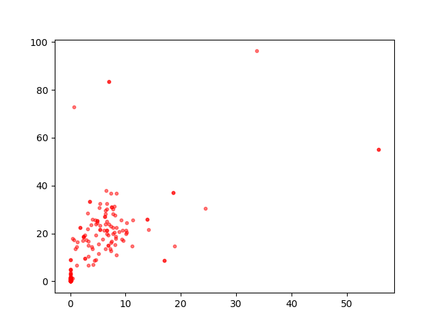
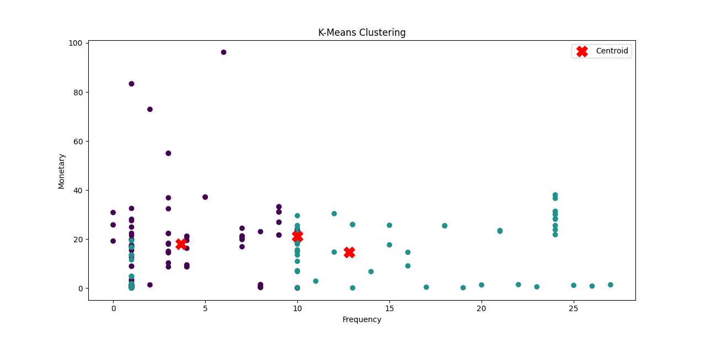
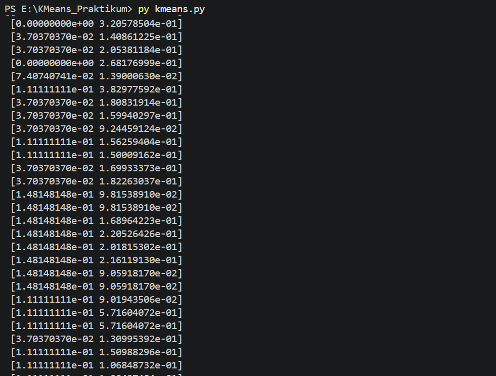
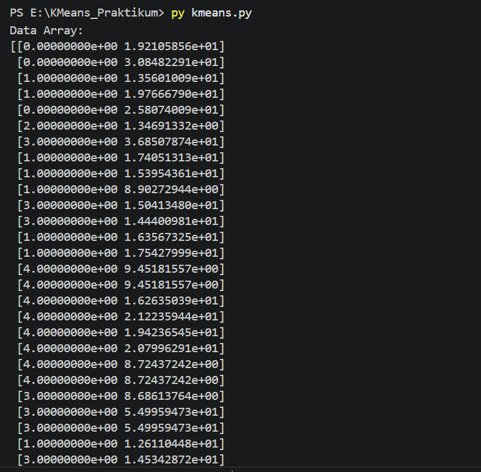
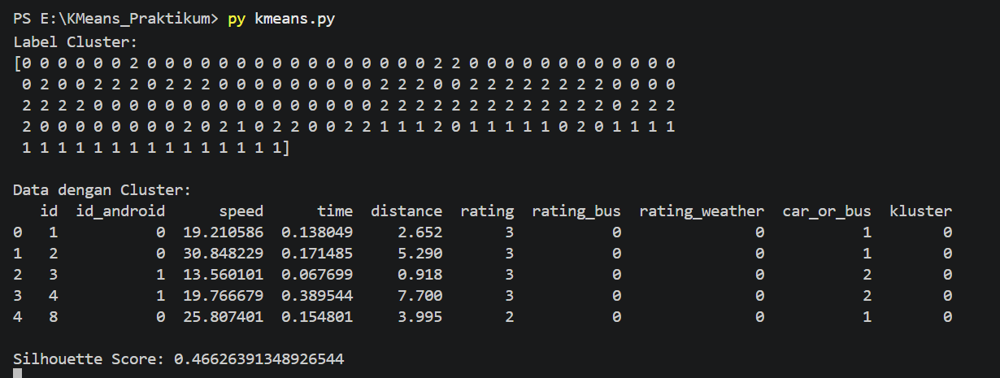

# K-Means Clustering pada Dataset GPS Trajectories

## Deskripsi

Proyek ini merupakan implementasi algoritma K-Means Clustering menggunakan dataset GPS Trajectories dari UCI Machine Learning Repository. Tujuan dari proyek ini adalah mengelompokkan data perjalanan berdasarkan karakteristik yang dimiliki sehingga data dengan karakteristik yang mirip berada pada cluster yang sama.

## Dataset

Dataset yang digunakan:

* Nama Dataset : GPS Trajectories
* Sumber : https://archive.ics.uci.edu/dataset/354/gps+trajectories

File yang digunakan:

```text
go_track_tracks.csv
```

## Library yang Digunakan

```python
import pandas as pd
import numpy as np
import matplotlib.pyplot as plt
import seaborn as sns

from sklearn.cluster import KMeans
from sklearn.preprocessing import MinMaxScaler
```

## Tahapan Pengerjaan

### 1. Import Library

Mengimpor library yang diperlukan untuk membaca data, melakukan preprocessing, visualisasi, dan clustering.

### 2. Membaca Dataset

Dataset dibaca menggunakan Pandas dan dikonversi ke dalam bentuk DataFrame.

### 3. Melihat Informasi Dataset

Melihat struktur data, jumlah atribut, tipe data, dan jumlah data yang tersedia.

### 4. Data Cleaning

Kolom `linha` dihapus karena tidak digunakan dalam proses clustering.

### 5. Pemilihan Fitur

Fitur yang digunakan untuk proses clustering adalah:

* Distance
* Speed

### 6. Konversi Data ke Array

Data yang telah dipilih dikonversi menjadi array NumPy agar dapat diproses oleh algoritma K-Means.

### 7. Normalisasi Data

Normalisasi dilakukan menggunakan Min-Max Scaling untuk menyamakan rentang nilai setiap fitur.

### 8. Pembuatan Model K-Means

Model K-Means dibuat dengan jumlah cluster sebanyak 3.

### 9. Pelatihan Model

Model dilatih menggunakan data yang telah dinormalisasi.

### 10. Hasil Clustering

Label cluster ditambahkan ke dataset sehingga setiap data memiliki informasi cluster masing-masing.

## Dokumentasi

### Figure 1 - Dataset Awal



Menampilkan sebagian isi dataset yang digunakan pada proses clustering.

---

### Figure 2 - Informasi Dataset



Menampilkan informasi dataset seperti jumlah data, jumlah atribut, dan tipe data setiap kolom.

---

### Figure 3 - DataFrame Setelah Preprocessing



Menampilkan dataset setelah dilakukan pembersihan data dan pemilihan atribut yang digunakan untuk clustering.

---

### Figure 4 - Hasil Konversi ke Array



Menampilkan hasil konversi data dari DataFrame menjadi array NumPy yang akan digunakan pada proses normalisasi dan clustering.

---

### Figure 5 - Hasil Evaluasi



Menampilkan hasil evaluasi yang diperoleh selama proses praktikum sesuai langkah pada modul yang digunakan.

## Hasil

Berdasarkan implementasi algoritma K-Means Clustering, data berhasil dikelompokkan ke dalam beberapa cluster berdasarkan kemiripan karakteristik perjalanan. Hasil clustering dapat digunakan untuk membantu analisis pola perjalanan pengguna berdasarkan atribut yang tersedia pada dataset.

## Kesimpulan

Algoritma K-Means Clustering berhasil diterapkan pada dataset GPS Trajectories. Proses clustering dilakukan melalui tahapan preprocessing, normalisasi data, pelatihan model, dan analisis hasil cluster. Hasil yang diperoleh menunjukkan bahwa data dapat dikelompokkan berdasarkan karakteristik yang serupa sehingga memudahkan proses analisis data perjalanan.

## Author

Nama : Nazwa Zalfa

Mata Kuliah : Pembelajaran Mesin
